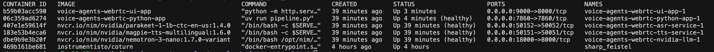
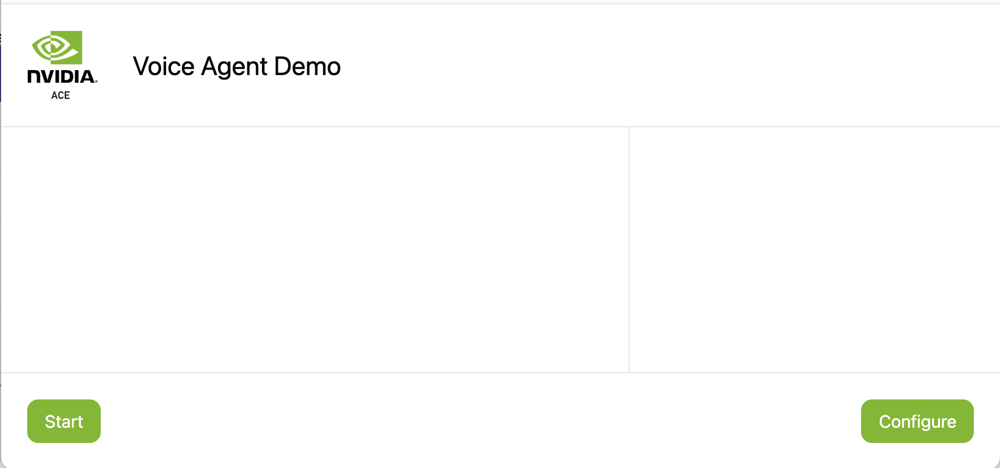

# Speech to Speech Demo

In this example, we showcase how to build a voice assistant pipeline using WebRTC with real-time transcripts. It uses Pipecat pipeline with FastAPI on the backend, and React on the frontend. This pipeline uses a WebRTC based SmallWebRTCTransport, Nemotron Speech ASR and TTS models and NVIDIA LLM Service.

## Prerequisites and Setup

1. Clone the voice-agent-examples repository:

   ```bash
   git clone https://github.com/NVIDIA/voice-agent-examples.git
   ```

2. Navigate to the example directory:

   ```bash
   cd voice-agent-examples/examples/voice_agent_webrtc
   ```

3. Copy and configure the environment file:

   ```bash
   cp env.example .env  # and add your credentials
   ```

4. Setup API keys in .env file:

   Ensure you have the required API keys:
   - NVIDIA_API_KEY - Required for accessing NIM ASR, TTS and LLM models

   Refer to [https://build.nvidia.com/](https://build.nvidia.com/) for generating your API keys.

   Edit the .env file to add your keys or export using:

   ```bash
   export NVIDIA_API_KEY=<YOUR_API_KEY>
   ```

5. Deploy Coturn Server if required

   If you want to share widely or want to deploy on cloud platforms, you will need to setup coturn server. Follow instructions below for modifications required in example code for using coturn:

   Update HOST_IP_EXTERNAL with your machine IP and run the below command:

   ```bash
   docker run -d --network=host instrumentisto/coturn -n --verbose --log-file=stdout --external-ip=<HOST_IP_EXTERNAL> --listening-ip=0.0.0.0 --lt-cred-mech --fingerprint --user=admin:admin --no-multicast-peers --realm=tokkio.realm.org --min-port=51000 --max-port=52000
   ```

   Set `TURN SERVER CREDENTIALS` in .env to use coturn server.

   And add the following configuration to your [`webrtc_ui/src/config.ts`](./webrtc_ui/src/config.ts) file to use the coturn server:

   ```typescript
   export const RTC_CONFIG: ConstructorParameters<typeof RTCPeerConnection>[0] = {
     iceServers: [
       {
         urls: "turn:<HOST_IP_EXTERNAL>:3478",
         username: "admin",
         credential: "admin",
       },
     ],
   };
   ```

   For more information, see the turn-server documentation at [https://webrtc.org/getting-started/turn-server](https://webrtc.org/getting-started/turn-server).

6. Deploy the application using either of the options below.

## Option 1: Deploy Using Docker

### Prerequisites

- You have access and are logged into NVIDIA NGC. For step-by-step instructions, refer to [the NGC Getting Started Guide](https://docs.nvidia.com/ngc/ngc-overview/index.html#registering-activating-ngc-account).
- You have access to an NVIDIA Turing™, NVIDIA Ampere (e.g., A100), NVIDIA Hopper (e.g., H100), NVIDIA Ada (e.g., L40S), or the latest NVIDIA GPU architectures. For more information, refer to [the Support Matrix](https://docs.nvidia.com/nim/riva/asr/latest/support-matrix.html).
- You have Docker installed with support for NVIDIA GPUs. For more information, refer to [the Support Matrix](https://docs.nvidia.com/nim/riva/asr/latest/support-matrix.html).

### Run

```bash
export NGC_API_KEY=nvapi-... # <insert your key>
docker login nvcr.io
```

From the examples/voice_agent_webrtc directory, run below commands:

```bash
docker compose up --build -d
```

This will start all the required services. You should see docker ps output similar to the following:



Docker deployment might take 30-45 minutes first time. Once all services are up and running, visit `http://<machine-ip>:9000/` in your browser to start interacting with the application. See the next sections for detailed instructions on interacting with the app.

## Option 2: Deploy Using Python Environment

### Requirements

- Python (>=3.12)
- [uv](https://github.com/astral-sh/uv)

All Python dependencies are listed in `pyproject.toml` and can be installed with `uv`.

### Run

```bash
uv venv
source .venv/bin/activate
uv sync

uv run pipeline.py
```

Then run the UI from [`../webrtc_ui/README.md`](../webrtc_ui/README.md). Visit `http://localhost:5173/` in your browser to start interacting with the application. See the next sections for detailed instructions on interacting with the app.

## Start interacting with the application



Note: To enable microphone access in Chrome, go to `chrome://flags/`, enable "Insecure origins treated as secure", add `http://<machine-ip>:9000` (for docker method), `http://localhost:5173/` (for python method) to the list, and restart Chrome.

## Bot pipeline customizations

### Speculative Speech Processing

Speculative speech processing reduces bot response latency by working directly on Nemotron Speech ASR early interim user transcripts instead of waiting for final transcripts. This feature only works when using Nemotron Speech ASR. Currently set to true.

- You can enable or disable this feature by setting the `ENABLE_SPECULATIVE_SPEECH` environment variable in your `.env` file (default is true).
- The application will automatically switch processors based on this flag; no code edits needed.
- See the [Documentation on Speculative Speech Processing](../../docs/SPECULATIVE_SPEECH_PROCESSING.md) for more details.

### Switching system prompts

Set `SYSTEM_PROMPT_SELECTOR` (e.g., in `.env`) to the desired entry from `prompt.yaml` based on use-case. Use `/` as the path delimiter, for example `llama-3.1-8b-instruct/flowershop` or `llama-3.1-8b-instruct/generic_voice_assistant`.

### Emotion-Aware Voice Synthesis: LLM-Driven Real-Time TTS Emotion Control

To enable this feature:

- Set `SYSTEM_PROMPT_SELECTOR="llama/tts_emotion_tags"` in your `.env` file.
- Adjust the `CHAT_HISTORY_LIMIT` variable to 3–5 for optimal performance and accuracy.

This enables the TTS voice to adapt its emotion based on the conversation context in real time.

> **Note:** Supported only when using the Magpie Multilingual TTS model with English(en-US) language.

### Enabling Multilingual Mode

To enable multilingual mode, set the following variables in your `.env` file:

```bash
ENABLE_MULTILINGUAL=true
ASR_MODEL_NAME=parakeet-rnnt-1.1b-unified-ml-cs-universal-multi-asr-streaming
SYSTEM_PROMPT_SELECTOR=llama-3.3-nemotron-super-49b-v1.5/multilingual_voice_assistant
NVIDIA_LLM_MODEL=nvidia/llama-3.3-nemotron-super-49b-v1.5
ASR_CLOUD_FUNCTION_ID=71203149-d3b7-4460-8231-1be2543a1fca #if using nvcf endpoint
```

If you are deploying with Docker Compose, also set the container image variables in your `.env` file:

```bash
NVIDIA_LLM_IMAGE=nvcr.io/nim/nvidia/llama-3.3-nemotron-super-49b-v1.5:1.15.4
ASR_DOCKER_IMAGE=nvcr.io/nim/nvidia/parakeet-1-1b-rnnt-multilingual:1.4.0
ASR_NIM_TAGS=mode=str
```

### TTS Text Filter

The TTS Text Filter cleans special or unsupported characters for Magpie TTS. You can tune your own cleaning rules in `riva_text_filter.py` as per your use case.

- Set `ENABLE_TTS_TEXT_FILTER=true` in your `.env` file to enable (default is true).
- **Limitation:** Only applies when `TTS_LANGUAGE` is set to `en-US`; automatically disabled for other languages.
- **Note:** Without the text filter, expect Magpie TTS failures. We created a filter for English, but consider tuning rules for other languages if required.

### Switching ASR, LLM, and TTS Models

You can easily customize ASR (Automatic Speech Recognition), LLM (Large Language Model), and TTS (Text-to-Speech) services by configuring environment variables. This allows you to switch between NIM cloud-hosted models and locally deployed models.

The following environment variables control the endpoints and models:

- `ASR_SERVER_URL`: Address of the Nemotron Speech ASR (speech-to-text) service (e.g., `localhost:50051` for local, "grpc.nvcf.nvidia.com:443" for [cloud endpoint](https://build.nvidia.com/)).
- `TTS_SERVER_URL`: Address of the Nemotron Speech TTS (text-to-speech) service. (e.g., `localhost:50051` for local, "grpc.nvcf.nvidia.com:443" for [cloud endpoint](https://build.nvidia.com/)).
- `NVIDIA_LLM_URL`: URL for the NVIDIA LLM service. (e.g., `http://<machine-ip>:8000/v1` for local, "https://integrate.api.nvidia.com/v1" for [cloud endpoint](https://build.nvidia.com/))

You can set model, language, and voice using the `ASR_MODEL_NAME`, `TTS_MODEL_NAME`, `NVIDIA_LLM_MODEL`, `ASR_LANGUAGE`, `TTS_LANGUAGE`, and `TTS_VOICE_ID` environment variables.

Update these variables in your .env file to match your deployment and desired models. For more details on available models and configuration options, refer to the [NIM NVIDIA Magpie](https://build.nvidia.com/nvidia/magpie-tts-multilingual), [NIM NVIDIA Parakeet](https://build.nvidia.com/nvidia/parakeet-ctc-1_1b-asr/api), and [NIM NEMOTRON NANO](https://build.nvidia.com/nvidia/nemotron-3-nano-30b-a3b) documentation.

#### Example: Switching between different LLM models

To switch between different LLM models, refer to the commented example blocks in the `env.example` file. You can either use cloud-hosted NVCF models or run local NIM containers by pulling the appropriate images. If running a local NIM container, be sure to review and adjust the allocated GPU devices to match both your requirements and those of the selected model.

Ensure you choose a prompt from prompt.yaml using the SYSTEM_PROMPT_SELECTOR that is compatible with your selected model.

#### Example: Setting up Zero-shot Magpie Latest Model

Follow these steps to configure and use the latest Zero-shot Magpie TTS model:

1. **Update environment variables**

   Set `TTS_DOCKER_IMAGE` to actual image tag `<magpie-tts-zeroshot-image:version>`.

   Then, configure the settings found in the `Zero-shot TTS Magpie Model` section of your env file.

   Make sure your NVIDIA_API_KEY, with access to the zero-shot model, is correctly entered in your `.env` file.

2. **Configuring Zero-shot Audio Prompt**

   To use your own custom voice with zero-shot TTS:

   - Place your desired audio sample in the workspace directory.
   - Mount the audio file into your container by adding a volume in your `docker-compose.yml` under the `python-app` service:

     ```yaml
     services:
       python-app:
         # ... existing code ...
         volumes:
           - ./audio_prompts:/app/audio_prompts
     ```

   - In your `.env` file, set the `ZERO_SHOT_AUDIO_PROMPT` variable to its path (relative to your application's root):
     - `ZERO_SHOT_AUDIO_PROMPT=audio_prompts/voice_sample.wav`  # Path relative to app root

   Note: The zero-shot audio prompt is only required when using the Magpie Zero-shot model. For standard Magpie multilingual models, this configuration should be omitted.

3. **Set TTS Environment Variables**

   In `.env` (for `python-app`), update:

   ```bash
   TTS_VOICE_ID=Magpie-ZeroShot.Female-1
   TTS_MODEL_NAME=magpie_tts_ensemble-Magpie-ZeroShot
   ```

### Enabling Audio Dumps

To capture raw audio streams for debugging ASR/TTS quality issues:

```bash
# In .env file
ENABLE_ASR_AUDIO_DUMP=true   # Save input audio
ENABLE_TTS_AUDIO_DUMP=true   # Save output audio
AUDIO_DUMP_PATH=./audio_dumps
```

Audio files are saved as WAV format with stream ID for correlation.

**Permission Issues**: If Docker creates the `audio_dumps` folder with different user permissions, accessing it later via Python deployment or another Docker container may fail. To resolve:

- Pre-create the folder before enabling: `mkdir -p ./audio_dumps`
- Or fix existing permissions: `sudo chown -R $(id -u):$(id -g) ./audio_dumps`
